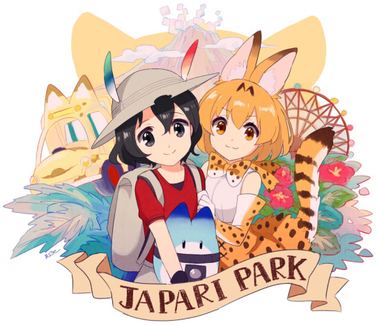

# Japari Park (development)

There will be a social network.  

The project has a modular architecture:

- Database (planned)
  * Sharding
- Backend on Django (planned)
  * DRF
- FriendsFrontend (WIP)  
  A social network "Friends", like twitter.
  * A Flask application that generates an process UI
  * An async server Gunicorn
  * NGINX proxy

The project be deployed on the Docker platform, in separate containers.

The CI-pattern is implemented on GitHub Actions.  
There are plans for partially or fully automated documentation.
